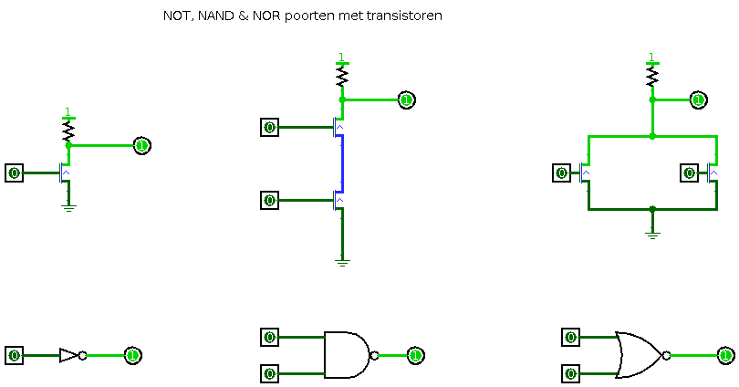

# Fun with computers
## Let's build a computer
### by ir. Marc Dendooven
---
# Introduction
When I discovered electronics and computers in the early '80, everything was **fun**.
Nowadays, most computer activities are **boring**:
Most people are just **using** there computers and have no interest for the system itself.
Even programmers and system administrators are just interested in their toplevel.

So I decided to write some text about having fun with computers.

This text is in an early phase and will change as I will write more.

A first part will be building a computer. Like a Jedi has to build his own light-sword,
a computer scientist needs to build his own computer system. This doesn't need to be in real hardware,
This can perfectly be done in a simulator. Of course nobody prevents you to build a real system,
but a simulator is more flexible, much cheaper, and more fun since you can try lot's of variations.

# Theoretical concepts
## Computers
## Structured Computer Architecture
## Numeral Systems
## Boolean Logic
## Building computers with switches

# Digital Logic
# 
